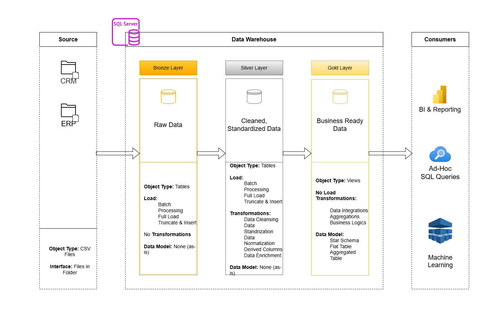

# Data Warehouse and Analytics Pipeline

This project demonstrates an end-to-end data solution that combines **data engineering and analytics**, covering the complete lifecycle from raw data ingestion to generating actionable business insights.

It is designed as a portfolio project to showcase practical implementation of:

* Modern data warehousing techniques
* ETL pipeline design
* Data modeling for analytics
* SQL-driven reporting and insight generation

---

## Data Architecture

The data architecture for this project follows Medallion Architecture **Bronze**, **Silver**, and **Gold** layers:



1. **Bronze Layer**: Stores raw data as-is from the source systems. Data is ingested from CSV Files into SQL Server Database.
2. **Silver Layer**: This layer includes data cleansing, standardization, and normalization processes to prepare data for analysis.
3. **Gold Layer**: Houses business-ready data modeled into a star schema required for reporting and analytics.

---

## Project Overview

This project includes both **data engineering** and **data analytics** components:

1. **Data Architecture**
Designing a scalable data warehouse using Medallion Architecture.

2. **ETL Pipelines**
Extracting, transforming, and loading data from source systems into the warehouse.

3. **Data Modeling**
Developing fact and dimension tables optimized for analytical queries.

4. **Analytics & Reporting**
Developing SQL queries to generate insights such as:

   * Customer segmentation
   * Product performance metrics
   * Revenue and sales trend analysis

5. **Reporting & Insights**
Enabling data-driven decision-making through structured and query-optimized datasets.

---

## Project Requirements

### Building the Data Warehouse (Data Engineering)

#### Objective

Develop a modern data warehouse using SQL Server to consolidate sales data, enabling analytical reporting and informed decision-making.

#### Specifications
- **Data Sources**: Import data from two source systems (ERP and CRM) provided as CSV files.
- **Data Quality**: Clean and standardize data before loading into analytical layers.
- **Integration**: Combine both sources into a single, user-friendly data model designed for analytical queries.
- **Scope**: Focus on the latest dataset only; historization of data is not required.
- **Documentation**: Provide clear documentation of the data model to support both business stakeholders and analytics teams.

---

### BI: Analytics & Reporting (Data Analysis)

#### Objective

Develop a comprehensive analytics layer using SQL to transform processed data into meaningful insights.

#### Key Focus Areas

* **Customer Behavior Analysis**

  * Identify high-value customers
  * Analyze purchase patterns

* **Product Performance**

  * Track top-performing products
  * Evaluate category-level trends

* **Sales Trends**

  * Monitor revenue growth over time
  * Identify seasonal patterns

* **Business Metrics**

  * KPIs such as total sales, order volume, and customer retention

#### Outcome

These insights empower stakeholders with key business metrics, enabling strategic decision-making.  

For more details, refer to [docs/requirements.md](docs/requirements.md).

---

## Repository Structure

```
data-warehouse-analytics-pipeline/
│
├── data_analysis						# Scripts and notebooks for exploratory data analysis and business insights
│
├── data_warehouse						# SQL scripts for ETL and transformations
│   ├── bronze/                    	# Scripts for extracting and loading raw data
│   ├── silver/                       	# Scripts for cleaning and transforming data
│   ├── gold/                         	# Scripts for creating analytical models
│   ├── tests/                        	# Test scripts and quality files
│
├── datasets/                         	# Raw datasets used for the project (ERP and CRM data)
│
├── docs/                             	# Project documentation and architecture details
│   ├── data_architecture.drawio     	# Draw.io file shows the project's architecture
│   ├── data_architecture.png        	# Exported image of the overall data architecture diagram
│   ├── data_catalog.md               	# Catalog of datasets, including field descriptions and metadata
│   ├── data_flow.drawio              	# Draw.io file for the data flow diagram
│   ├── data_flow.png                 	# Exported image of the data flow diagram
│   ├── data_integration.drawio       	# Draw.io file for data integration (star schema)
│   ├── data_integration.png          	# Exported image of the data integration (star schema) diagram
│   ├── data_models.drawio            	# Draw.io file for data models (star schema)
│   ├── data_models.png               	# Exported image of the data models (star schema) diagram
│   ├── naming-conventions.md         	# Consistent naming guidelines for tables, columns, and files
│
├── README.md                         	# Project overview and instructions
├── LICENSE                            # License information for the repository
├── .gitignore                         # Files and directories to be ignored by Git
└── requirements.txt                   # Dependencies and requirements for the project
```

---

## License

This project is licensed under the [MIT License](LICENSE). You are free to use, modify, and share this project with proper attribution.

---
